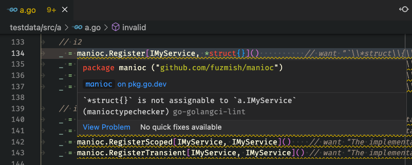

# manioctypechecker

A static type checker for [manioc](https://github.com/fuzmish/manioc).

## Screenshot

You can integrate this linter into [VSCode](https://code.visualstudio.com/) using [golangci-lint](https://github.com/golangci/golangci-lint) and [Go Extension](https://marketplace.visualstudio.com/items?itemName=golang.Go):  


## Setup

### With `go vet`

1. Build a vettool binary.:
   ```sh
   $ cd /usr/local/src
   $ git clone --depth=1 https://github.com/fuzmish/manioc
   $ cd manioc/linter/manioctypechecker
   $ make build-vettool
   $ ls bin
   manioctypechecker
   ```
2. Move to your project, then run:
   ```sh
   $ go vet -vettool=/usr/local/src/manioc/linter/manioctypechecker/bin/manioctypechecker ./...
   ```

### With `golangci-lint`

1. Make sure your `golangci-lint` has been [installed from source](https://golangci-lint.run/usage/install/#install-from-source). Verify its version:
   ```sh
   $ golangci-lint --version
   golangci-lint has version v1.46.2 built from (unknown, mod sum: "...") on (unknown)
   ```
2. Build a plugin binary. Set the version of `golangci-lint` to the environment variable `GOLANGCI_LINT_TARGET_VERSION` if needed:
   ```sh
   $ cd /usr/local/src
   $ git clone --depth=1 https://github.com/fuzmish/manioc
   $ cd manioc/linter/manioctypechecker
   $ GOLANGCI_LINT_TARGET_VERSION=v1.46.2 make build-golangci-plugin
   $ ls bin
   manioctypechecker.so
   ```
3. Move to your project, then configure your `.golangci.yml`:
   ```yml
   linters-settings:
     custom:
       manioctypechecker:
         # the path to the plugin binary
         path: /usr/local/src/manioc/linter/manioctypechecker/bin/manioctypechecker.so
         description: A static type checker for github.com/fuzmish/manioc
         original-url: github.com/fuzmish/manioctypechecker
   linters:
     enable:
       # then enable it
       - manioctypechecker
   ```
4. Run:
   ```sh
   $ golangci-lint run --disable-all -E govet,manioctypechecker
   ```

## References

- https://pkg.go.dev/cmd/go
- https://golangci-lint.run/contributing/new-linters/
